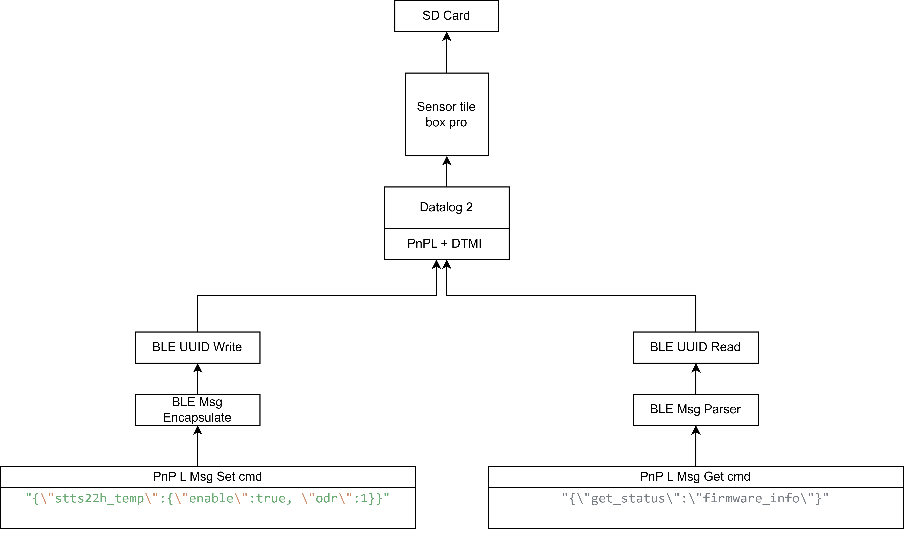

# Datalog2 Python Code

## Requirements


#### Hardware
* SensorTileBox.Pro
    * [FP-SNS-DATALOG2](https://github.com/STMicroelectronics/fp-sns-datalog2)
#### Software
* Python 3.12
    * [asyncio](https://pypi.org/project/asyncio/)
    * [bleak](https://pypi.org/project/bleak/)

# Getting Started
## Graphical Overview



## BLE Characteristics
After turning ON the SensorTileBox.Pro , it advertises with the name `HSD2v30` and exposes below characteristics with writable and readable GATT.
```
COPY_MACHINE_LEARNING_CORE_CHAR_UUID	0000000F-0002-11e1-ac36-0002a5d5c51b
COPY_HIGH_SPEED_DATA_LOG_CHAR_UUID	00000011-0002-11e1-ac36-0002a5d5c51b 
COPY_EXT_CONFIG_CHAR_UUID	        00000014-0002-11e1-ac36-0002a5d5c51b 
COPY_PNPLIKE_CHAR_UUID	                0000001b-0002-11e1-ac36-0002a5d5c51b 
COPY_RAW_PNPL_CONTROLLED_CHAR_UUID	00000023-0002-11e1-ac36-0002a5d5c51b 
```

## SensorTileBox.Pro with BLE
FP-SNS-DATALOG2 software is controlled by JSON like PnPL commands. These commands has to be written in this GATT UUID :
```
COPY_PNPLIKE_CHAR_UUID	                0000001b-0002-11e1-ac36-0002a5d5c51b
```
Below are some examples of the Commands :

* To enable a sensor `stts22h`
```
{"stts22h_temp": {"enable": true}}
```
* To start the `logger`
```
{"log_controller*start_log": {"interface": 2}}
```
* To end the `logger`
```
{"log_controller*stop_log": {"interface": 2}}
```
> :memo: **Note:** Interface enum 0 = SD Card,
> Interface enum 1 = USB and,
> Interface enum 2 = BLE

## Python Code

```
import asyncio
from bleak import BleakScanner, BleakClient

# BLE TP protocol headers
BLE_MTU = 20
TP_START = 0x00
TP_START_END = 0x20
TP_MIDDLE = 0x40
TP_END = 0x80

# Device and characteristic
DEVICE_NAME = "HSD2v30"
COPY_PNPLIKE_CHAR_UUID = "0000001b-0002-11e1-ac36-0002a5d5c51b"

def encapsulate_ble_packets(message: str):
    data = message.encode("utf-8")
    max_payload = BLE_MTU - 1
    packets = []

    if len(data) <= max_payload:
        packets.append(bytes([TP_START_END]) + data)
    else:
        i = 0
        packets.append(bytes([TP_START]) + data[i:i+max_payload])
        i += max_payload
        while i + max_payload < len(data):
            packets.append(bytes([TP_MIDDLE]) + data[i:i+max_payload])
            i += max_payload
        packets.append(bytes([TP_END]) + data[i:])
    return packets

def notification_handler(sender, data):
    try:
        decoded = data[1:].decode("utf-8")  # skip 1-byte header
    except:
        decoded = data
    print(f"[Notification] Raw: {data.hex()} | Decoded: {decoded}")

async def send_json_message(client, message: str):
    packets = encapsulate_ble_packets(message)
    for i, packet in enumerate(packets):
        await client.write_gatt_char(COPY_PNPLIKE_CHAR_UUID, packet)
        print(f"Sent packet {i+1}/{len(packets)}: {packet.hex()}")

async def main():
    print("Scanning for device...")
    address = None
    devices = await BleakScanner.discover(timeout=5)
    for d in devices:
        if d.name == DEVICE_NAME:
            address = d.address
            break

    if not address:
        print("Device not found.")
        return

    async with BleakClient(address) as client:
        print(f"Connected to {DEVICE_NAME} ({address})")
        await client.start_notify(COPY_PNPLIKE_CHAR_UUID, notification_handler)

        # 1. Sensor setup
        msg4 = "{\"get_status\":\"firmware_info\"}"
        await send_json_message(client, msg4)

        # 1. Sensor setup
        msg1 = "{\"stts22h_temp\":{\"enable\":true, \"odr\":1}}"
        await send_json_message(client, msg1)

        # 2. Start log
        msg2 = "{\"log_controller*start_log\": {\"interface\": 2}}"
        await send_json_message(client, msg2)

        # 3. Wait 5 seconds
        await asyncio.sleep(5)

        # 4. Stop log
        msg3 = "{\"log_controller*stop_log\": {\"interface\": 2}}"
        await send_json_message(client, msg3)

        # Keep listening for 10 seconds
        print("Listening for responses...")
        await asyncio.sleep(10)
        await client.stop_notify(COPY_PNPLIKE_CHAR_UUID)
        print("Done.")

asyncio.run(main())

```

## Typical output

```
Scanning for device...
Connected to HSD2v30 (D1:85:1F:DF:37:D2)
Sent packet 1/3: 007b22737474733232685f74656d70223a7b2265
Sent packet 2/3: 406e61626c65223a747275652c20226f6472223a
Sent packet 3/3: 80317d7d
Sent packet 1/3: 007b226c6f675f636f6e74726f6c6c65722a7374
Sent packet 2/3: 406172745f6c6f67223a207b22696e7465726661
Sent packet 3/3: 806365223a20327d7d
[Notification] Raw: 207b22506e504c5f4572726f72223a2220436f6d706f6e656e7420646f65736e2774206578697374227d00 | Decoded: {"PnPL_Error":" Component doesn't exist"} 
[Notification] Raw: 207b22506e504c5f4572726f72223a2220436f6d706f6e656e7420646f65736e2774206578697374227d00 | Decoded: {"PnPL_Error":" Component doesn't exist"} 
Sent packet 1/3: 007b226c6f675f636f6e74726f6c6c65722a7374
Sent packet 2/3: 406f705f6c6f67223a207b22696e746572666163
Sent packet 3/3: 8065223a20327d7d
Listening for responses...
[Notification] Raw: 207b22506e504c5f4572726f72223a2220436f6d706f6e656e7420646f65736e2774206578697374227d00 | Decoded: {"PnPL_Error":" Component doesn't exist"} 
Done.

```
>> Currently It is not working as expected.

# Python Code explanation
The JSON like PnPL commands has to be excapsulated into MTU size of 20 bytes including the start and stop byte inside of the `def encapsulate_ble_packets()`  function so that DATALOG2 Software available in the SensorTileBox.Pro can properly parse the command else discard it. Below is the 1byte header :

```
BLE_MTU = 20
TP_START = 0x00
TP_START_END = 0x20
TP_MIDDLE = 0x40
TP_END = 0x80
```

so for a message more that 20 Bytes i.e., `{\"stts22h_temp\":{\"enable\":true, \"odr\":1}}`
, the python code converts it into little chunks of 3 with the first chunk starts with `TP_START = 0x00` header and middle packet with `TP_MIDDLE = 0x40` and finally the last packet with `TP_END = 0x80`
```
Packet 1/3: 007b22737474733232685f74656d70223a7b2265
Packet 2/3: 406e61626c65223a747275652c20226f6472223a
Packet 3/3: 80317d7d
```
>> :memo: **Note :**  a backslash \ has to be added in the message so that python doesn't flag error. 

