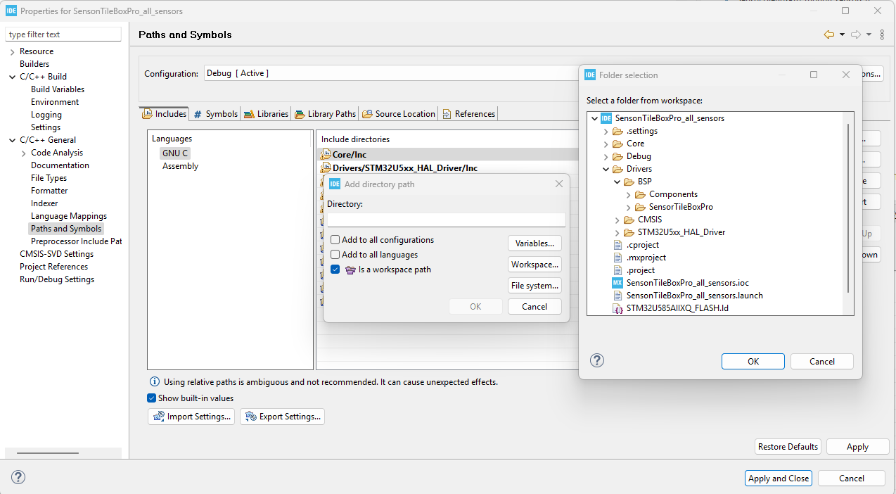
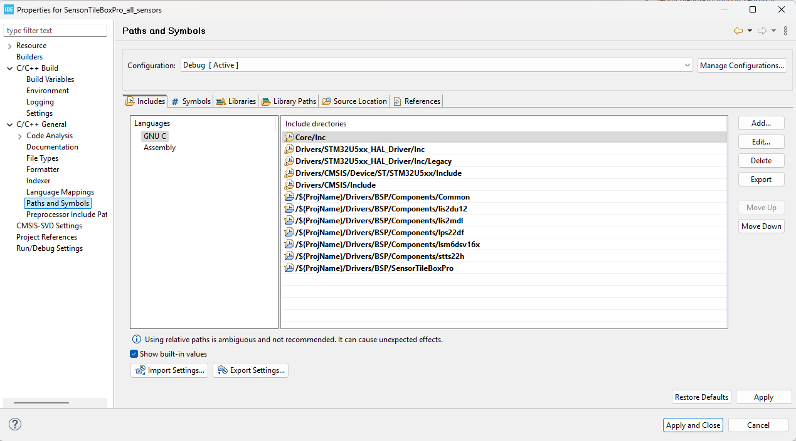
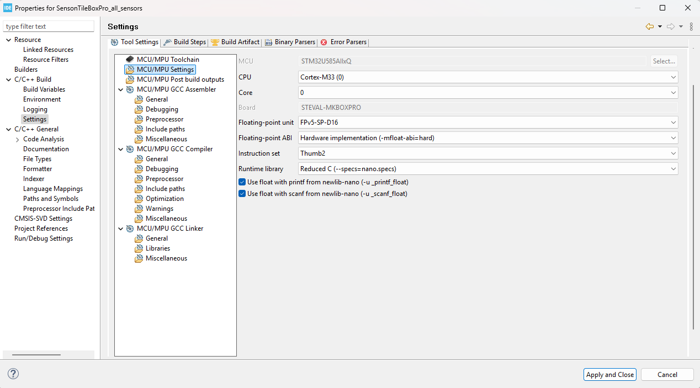
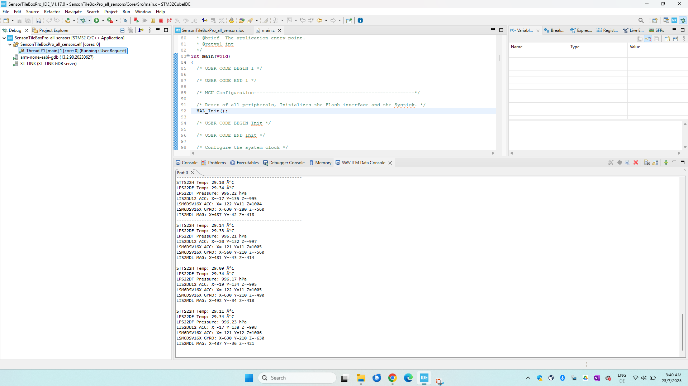

# SensorTile.BOXPRO  BSP- All Sensor - polling Mode Output - without RTOS - Demo

## Requirements

#### Hardware
* SensorTileBox.Pro
#### Software
* STM32CubeIDE 1.17.0
> STM32CubeIDE Error with STM32Cube project creation in v1.19.0


# Getting Started
* Copy the Core and Drivers folder from STTS22H Project folder into the newly created empty project. 
> Initialize a TIM (timer) peripheral to be added into empty project. By default, TIM is not initialized, and BSP related sensor codes uses TIM modules in the imports.

Now add the BSP folder to Build configuration. For that, click on ```Project_name > Properties > C/C++ general > Paths and Symbols > Includes ( Languages GNU) > Click on 'Add' > select 'Is a workspace path' > Workspaces```  it opens list of the projects



now select the folders individually. Finally, It will look like this 



> If there is warning regarding ```printf``` use in main.c , click on ```Project_name > Properties > C/C++ build > settings > tool settings > MCU/MPU Settings```  and  click on ***use float with printf .. and use float with scanf...***



now click on debug, ***Enable the SWV*** and upload to the device.
> use SWV in ITM Console at port 0 to view outputs.
# Current output

